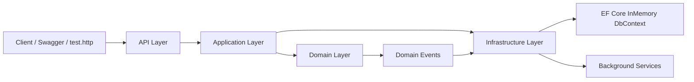

# Subscription Billing System

A controller-based ASP.NET Core Web API for managing customers, subscriptions, invoices, recurring billing, and invoice payments.

This solution is implemented as a small modular monolith with:

- Domain-Driven Design (DDD)
- Clean Architecture
- CQRS-style application handlers
- EF Core InMemory persistence
- Transactional outbox
- Idempotent command processing
- Background hosted services
- Unit tests across all layers

## Table of Contents

- [Overview](#overview)
- [Core Features](#core-features)
- [Architecture](#architecture)
- [Project Structure](#project-structure)
- [Domain Design](#domain-design)
- [Application Layer](#application-layer)
- [Infrastructure Layer](#infrastructure-layer)
- [API Surface](#api-surface)
- [Error Handling](#error-handling)
- [Running Locally](#running-locally)
- [Testing the API](#testing-the-api)
- [Automated Tests](#automated-tests)
- [Key Technical Decisions](#key-technical-decisions)
- [Trade-offs and Limitations](#trade-offs-and-limitations)
- [Additional Documentation](#additional-documentation)
- [Review Guide](#review-guide)

## Overview

The system models a simple subscription billing workflow:

1. Create a customer
2. Create a subscription for that customer
3. Generate the initial invoice automatically
4. Pay invoices using a supported payment mode
5. Run recurring billing for due subscriptions
6. Query invoices with filtering and paging
7. Cancel subscriptions while preserving invoice history

The code is split so business rules stay inside the domain model, use cases stay in the application layer, technical implementations stay in infrastructure, and HTTP concerns stay in the API project.

## Core Features

- Create customers
- Create subscriptions with `Minutes`, `Hours`, `Days`, or `Months` billing cycles
- Generate an initial invoice at subscription activation
- Generate future invoices through a recurring billing process
- Pay invoices using `Cash`, `Check`, or `Online`
- Cancel subscriptions
- Query invoices by `customerId`, `subscriptionId`, `status`, `pageNumber`, and `pageSize`
- Return Problem Details for business and request errors
- Persist domain events into an outbox
- Support idempotent command endpoints with `Idempotency-Key`

## Architecture



### Layer Responsibilities

| Layer | Responsibility |
| --- | --- |
| `SubscriptionBilling.Api` | HTTP endpoints, request/response contracts, Swagger, middleware, composition root |
| `SubscriptionBilling.Application` | Commands, queries, handlers, ports, repository abstractions, use-case orchestration |
| `SubscriptionBilling.Domain` | Aggregates, value objects, enums, domain events, business invariants |
| `SubscriptionBilling.Infrastructure` | EF Core, repositories, idempotency store, outbox, background services, payment gateway implementation |

## Project Structure

```text
src/
  SubscriptionBilling.Api/
  SubscriptionBilling.Application/
  SubscriptionBilling.Domain/
  SubscriptionBilling.Infrastructure/

tests/
  SubscriptionBilling.Api.Tests/
  SubscriptionBilling.Application.Tests/
  SubscriptionBilling.Domain.Tests/
  SubscriptionBilling.Infrastructure.Tests/

docs/
  ddd-context-map.md
  ubiquitous-language.md
```

## Domain Design

The domain layer is where the real business rules live.

### Aggregates

| Aggregate | Responsibility |
| --- | --- |
| `Customer` | Owns customer identity and contact information |
| `Subscription` | Owns lifecycle state, billing cadence, and due invoice generation |
| `Invoice` | Owns invoice state and payment transitions |

### Value Objects

| Value Object | Purpose |
| --- | --- |
| `Money` | Amount + currency |
| `EmailAddress` | Validated customer email |
| `BillingCycle` | Billing interval + unit |
| `InvoiceGenerationDraft` | Draft data used to create invoices without coupling aggregates too tightly |

### Domain Rules Enforced in the Model

- A customer cannot be created without a valid name and email
- A subscription cannot be created without a valid customer, plan, amount, and billing cycle
- A subscription generates the initial invoice only once
- A cancelled subscription does not generate future invoices
- An invoice cannot be paid twice
- A payment must include a valid payment mode and external payment reference

### Domain Events

The domain emits business events when important state changes happen:

- `SubscriptionActivatedDomainEvent`
- `InvoiceGeneratedDomainEvent`
- `PaymentReceivedDomainEvent`

These events are raised from the aggregates and persisted to the outbox during the same unit-of-work save.

## Application Layer

The application layer exposes the use cases of the system through explicit commands and queries.

### Commands

- `CreateCustomerCommand`
- `CreateSubscriptionCommand`
- `CancelSubscriptionCommand`
- `PayInvoiceCommand`
- `RunBillingCycleCommand`

### Queries

- `GetInvoicesQuery`

### Application Characteristics

- Handlers orchestrate repositories and domain behavior
- Business rules remain in the domain model
- Command handlers can be wrapped with an idempotency decorator
- The `Payments` boundary is abstracted behind `IPaymentGateway`

## Infrastructure Layer

Infrastructure contains the technical implementations behind the application ports.

### Persistence

- EF Core `DbContext`
- EF Core InMemory provider
- Repository implementations for customers, subscriptions, invoices, and invoice reads

The current provider is configured as:

```csharp
options.UseInMemoryDatabase("SubscriptionBillingDb")
```

### Idempotency

Mutation endpoints require an `Idempotency-Key` header.

The command flow is:

1. Controller receives the key from the request header
2. The idempotency decorator acquires a per-key lock
3. If a cached response exists, it is returned
4. Otherwise the inner handler runs
5. The response is serialized and stored

This prevents duplicate command execution for repeated requests with the same key inside the current application process.

### Transactional Outbox

The outbox stores durable representations of domain events in the same persistence boundary as aggregate changes.

Stable event discriminators are used instead of CLR assembly-qualified names:

- `subscription-activated`
- `invoice-generated`
- `payment-received`

### Background Services

Two hosted services are registered:

| Service | Responsibility |
| --- | --- |
| `BillingCycleBackgroundService` | Periodically runs the recurring billing use case |
| `OutboxBackgroundService` | Periodically processes pending outbox messages |

Default polling settings are defined in `src/SubscriptionBilling.Api/appsettings.json`:

- `BillingCyclePollingIntervalSeconds = 15`
- `OutboxPollingIntervalSeconds = 10`

### Payment Boundary

Payments are intentionally abstracted through:

- `IPaymentGateway`
- `ChargePaymentRequest`
- `ChargePaymentResult`

The current infrastructure implementation is `SimulatedPaymentGateway`, which behaves like an anti-corruption layer between the domain/application model and an external payment provider.

## API Surface

### Endpoint Order

The controllers are organized in the following logical order:

1. Customers
2. Subscriptions
3. Invoices
4. Billing

### Endpoints

| Method | Route | Description | Idempotency Header |
| --- | --- | --- | --- |
| `POST` | `/api/customers` | Create a customer | Required |
| `POST` | `/api/subscriptions` | Create a subscription | Required |
| `POST` | `/api/subscriptions/{subscriptionId}/cancel` | Cancel a subscription | Required |
| `GET` | `/api/invoices` | Query invoices with filters and paging | Not required |
| `POST` | `/api/invoices/{invoiceId}/pay` | Pay an invoice | Required |
| `POST` | `/api/billing/run` | Manually trigger the billing cycle | Not required |

### Invoice Query Parameters

| Parameter | Type | Notes |
| --- | --- | --- |
| `customerId` | `Guid?` | Optional |
| `subscriptionId` | `Guid?` | Optional |
| `status` | `InvoiceStatus?` | Optional, strongly typed enum |
| `pageNumber` | `int` | Default `1`, minimum `1` |
| `pageSize` | `int` | Default `50`, range `1..200` |

### Supported Enums

#### Billing Interval Unit

- `Minutes`
- `Hours`
- `Days`
- `Months`

#### Payment Mode

- `Cash`
- `Check`
- `Online`

#### Invoice Status

- `Pending`
- `Paid`

## Error Handling

The API uses a global exception middleware and returns RFC 7807-style Problem Details payloads.

### Exception Mapping

| Exception Type | HTTP Status |
| --- | --- |
| `DomainException` | `400 Bad Request` |
| `NotFoundException` | `404 Not Found` |
| `BadHttpRequestException` | `400 Bad Request` |
| `ArgumentException` | `400 Bad Request` |
| unexpected exceptions | `500 Internal Server Error` |

### Example Problem Details Response

```json
{
  "title": "Invalid request.",
  "status": 400,
  "detail": "The Idempotency-Key header is required for this operation.",
  "instance": "/api/customers",
  "traceId": "..."
}
```

## Running Locally

### Prerequisites

- .NET 8 SDK or a compatible SDK installed locally

### Start the API

```powershell
dotnet run --project .\src\SubscriptionBilling.Api\SubscriptionBilling.Api.csproj
```

### Local URLs

- API: [http://localhost:5009](http://localhost:5009)
- Swagger UI: [http://localhost:5009/swagger](http://localhost:5009/swagger)

The development launch profile is configured to open Swagger automatically.

### Build the Solution

```powershell
dotnet build .\SubscriptionBilling.slnx
```

## Testing the API

### Swagger

Use Swagger for interactive testing in the browser.

For mutation endpoints, provide an `Idempotency-Key` value in the request header field shown by Swagger.

### HTTP File

A ready-to-run request flow is available in:

- `src/SubscriptionBilling.Api/test.http`

This file contains a full sequence for:

- creating a customer
- creating subscriptions
- querying invoices
- paying invoices
- cancelling a subscription
- manually triggering billing

## Automated Tests

The solution contains separate test projects for each layer:

| Project | Focus |
| --- | --- |
| `SubscriptionBilling.Domain.Tests` | Aggregate invariants, value objects, domain events |
| `SubscriptionBilling.Application.Tests` | Command and query handler behavior |
| `SubscriptionBilling.Infrastructure.Tests` | Repositories, idempotency, outbox, persistence helpers, DI |
| `SubscriptionBilling.Api.Tests` | Controllers, middleware, request-level behavior |

### Run All Tests

```powershell
dotnet test .\SubscriptionBilling.slnx
```

### Run Individual Test Projects

```powershell
dotnet test .\tests\SubscriptionBilling.Domain.Tests\SubscriptionBilling.Domain.Tests.csproj
dotnet test .\tests\SubscriptionBilling.Application.Tests\SubscriptionBilling.Application.Tests.csproj
dotnet test .\tests\SubscriptionBilling.Infrastructure.Tests\SubscriptionBilling.Infrastructure.Tests.csproj
dotnet test .\tests\SubscriptionBilling.Api.Tests\SubscriptionBilling.Api.Tests.csproj
```

## Key Technical Decisions

### Why a Rich Domain Model

The core business rules are encoded in aggregates and value objects rather than in controllers or EF entities used as passive records. This keeps the billing behavior easier to reason about and defend in a code review.

### Why Explicit Handlers Instead of a Generic Mediator Package

The application layer uses explicit command/query handlers without bringing in MediatR. This keeps the code small, transparent, and dependency-light while preserving the same architectural intent.

### Why EF Core InMemory

The task explicitly allows EF Core, and the in-memory provider keeps the sample easy to run with no database installation. The repository and unit-of-work boundaries make it straightforward to swap to a relational provider later.

### Why Stable Outbox Discriminators

Outbox rows use explicit string discriminators instead of assembly-qualified CLR type names. This makes the persisted event contract more stable across refactors.

### Why Typed Invoice Status Filtering

The invoice query API exposes a typed `InvoiceStatus` filter instead of a raw string so the contract is clearer in Swagger and safer inside the application and infrastructure layers.

## Trade-offs and Limitations

- Persistence is in-memory, so data is lost when the process stops
- Idempotency coordination is process-local because the sample uses EF Core InMemory instead of a shared database
- The payment gateway is simulated, not integrated with a real provider
- The outbox processor currently logs and marks events as processed rather than publishing to a message broker
- Authentication and authorization are intentionally out of scope

## Additional Documentation

Further DDD-oriented project notes are available in:

- [docs/ddd-context-map.md](docs/ddd-context-map.md)
- [docs/ubiquitous-language.md](docs/ubiquitous-language.md)

## Review Guide

If you want to review the code quickly, start here:

- `src/SubscriptionBilling.Domain/Aggregates/Subscription.cs`
- `src/SubscriptionBilling.Domain/Aggregates/Invoice.cs`
- `src/SubscriptionBilling.Application/Features/Subscriptions/CreateSubscriptionCommandHandler.cs`
- `src/SubscriptionBilling.Application/Features/Invoices/PayInvoiceCommandHandler.cs`
- `src/SubscriptionBilling.Infrastructure/Persistence/EfUnitOfWork.cs`
- `src/SubscriptionBilling.Infrastructure/Services/IdempotentCommandHandlerDecorator.cs`
- `src/SubscriptionBilling.Api/Middleware/ExceptionHandlingMiddleware.cs`

These files show the most important architectural decisions in the smallest number of places.
